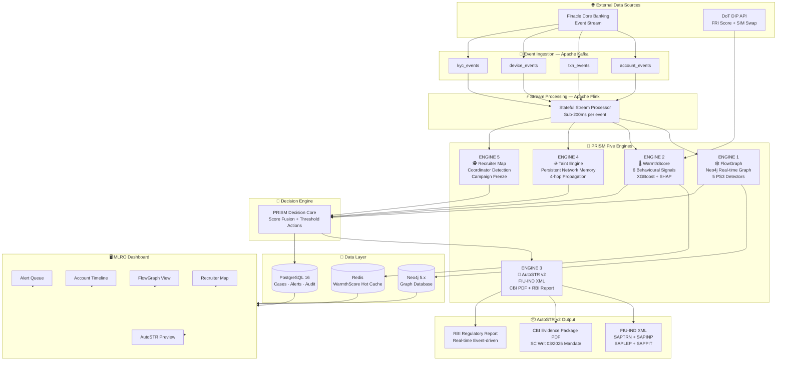
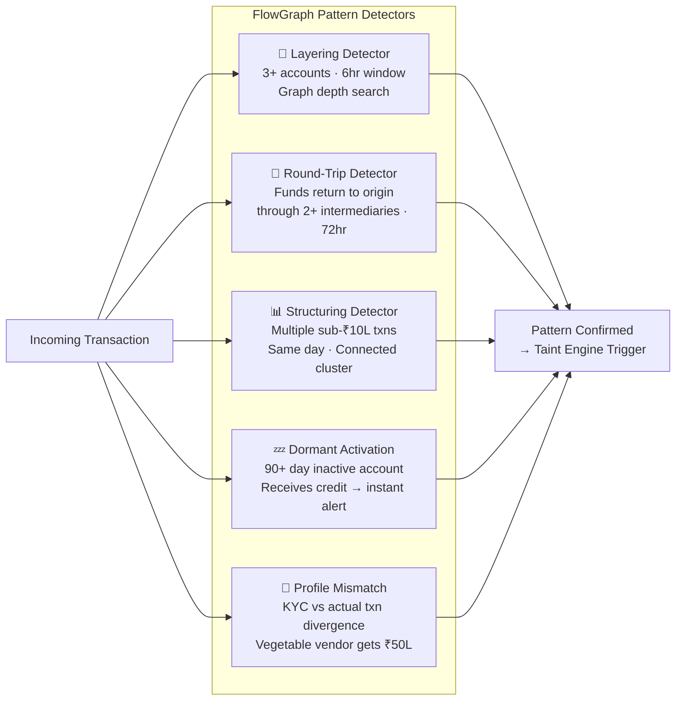
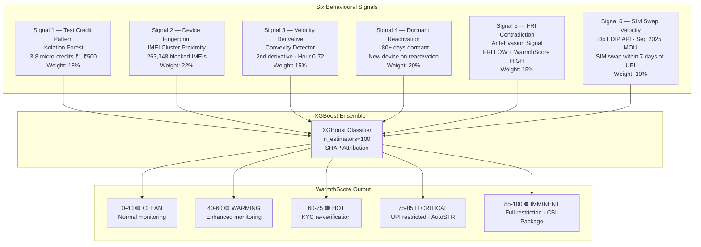
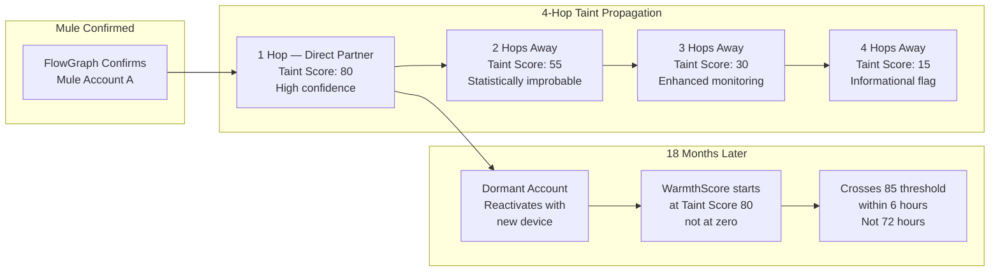
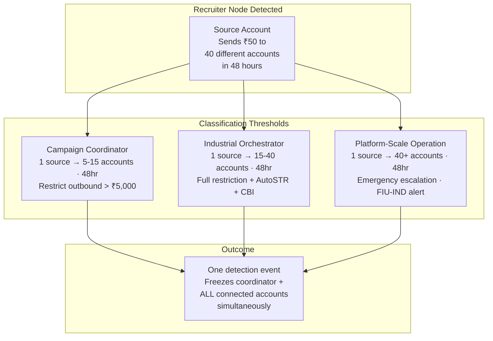
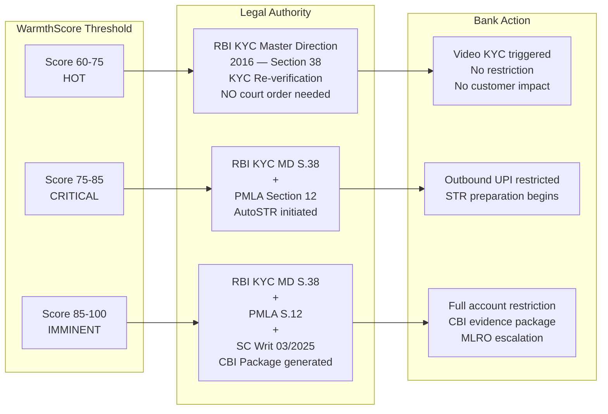
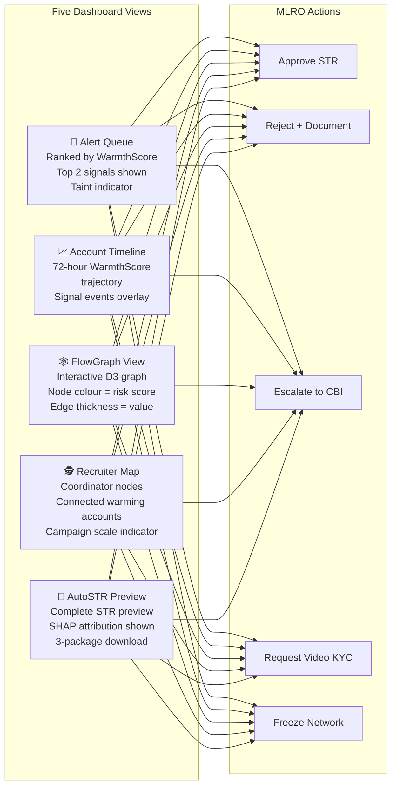
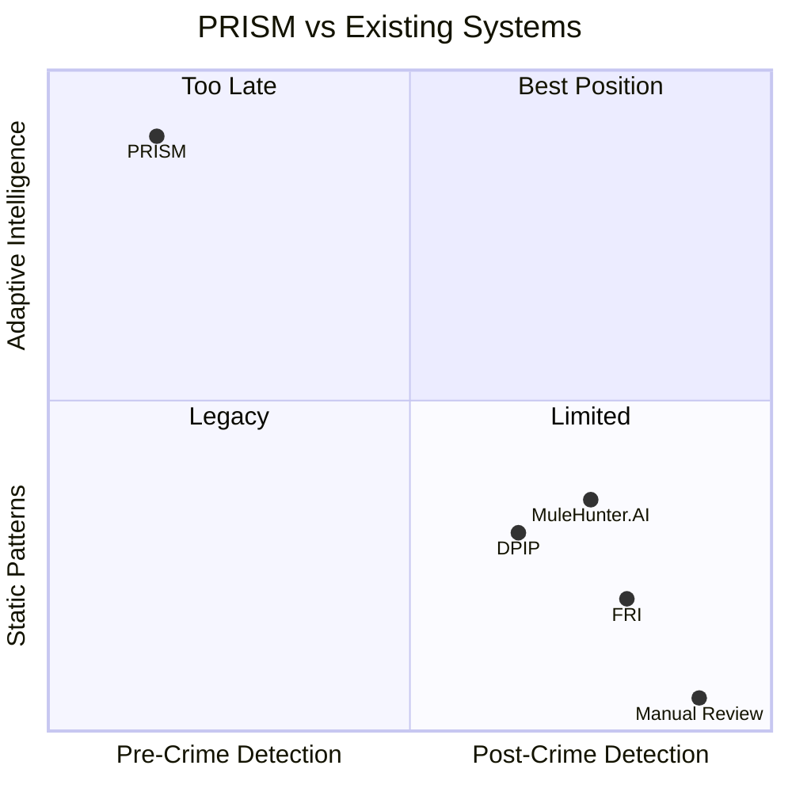
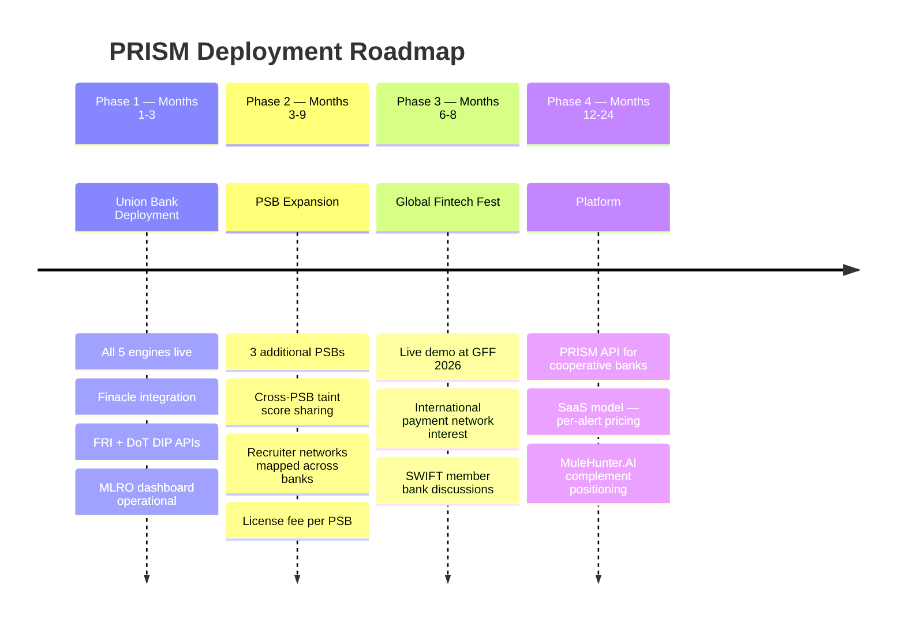

<div align="center">

```
 █████╗ ██████╗  ██████╗ ██╗   ██╗███████╗
██╔══██╗██╔══██╗██╔════╝ ██║   ██║██╔════╝
███████║██████╔╝██║  ███╗██║   ██║███████╗
██╔══██║██╔══██╗██║   ██║██║   ██║╚════██║
██║  ██║██║  ██║╚██████╔╝╚██████╔╝███████║
╚═╝  ╚═╝╚═╝  ╚═╝ ╚═════╝  ╚═════╝ ╚══════╝
```

# PRISM — Pre-crime Intelligence System for Mule Detection

**The hundred-eyed guardian. Always watching. Never sleeping.**

[](https://python.org)
[](https://fastapi.tiangolo.com)
[](https://react.dev)
[](https://neo4j.com)
[](https://kafka.apache.org)
[](LICENSE)
[](https://ideahackathon.com)
[](https://unionbankofindia.co.in)

---

> *MuleHunter.AI detects mule accounts after funds arrive. FRI flags numbers already known to be fraudulent.*
> *India's largest banks are reverting to branch visits because they have no third option.*
> **PRISM is the third option.**

**By the time the money moves, the FIU report is already written.**

</div>

---

## 📊 The Crisis — Why PRISM Exists

| Metric | Value | Context |
|--------|-------|---------|
| 🏦 FY25 Total Bank Fraud | **₹36,014 Crore** | 194% increase year-on-year |
| 📈 FY26 H1 Fraud Value | **₹21,515 Crore** | Already 60% of full FY25 in just 6 months |
| 🏛️ PSB Share of Losses | **71% (₹25,667 Cr)** | Public sector banks absorb the majority |
| ⚡ UPI Fraud Cashout | **15 seconds** | Batch systems reviewing 8-hour-old data are dead |
| 🏦 Banks with MuleHunter.AI | **23 banks** | Detects mules *after* funds arrive — too late |
| 🔄 Digital Onboarding | **Paused at SBI, BoI, BoB, ICICI** | Reverting to 1990s branch verification |

**The critical insight:** Fraud cases fell 72%. Fraud *value* rose 30%. Fewer criminals, each stealing exponentially more. Industrial organised operations replacing random fraud. Industrial operations leave patterns. **PRISM reads those patterns.**

---

## 🏗️ System Architecture



---

## 🔬 The Five Engines

### ENGINE 1 — FlowGraph (PS3 Core Coverage)

Real-time Neo4j transaction graph. Every account is a node. Every transaction is an edge. Five pattern detectors covering 100% of PS3 requirements.



---

### ENGINE 2 — WarmthScore (Pre-Crime Detection)

Six behavioural signals detecting mule account warming **72 hours before the first illicit rupee arrives.** XGBoost ensemble with SHAP explainability for every MLRO decision.



---

### ENGINE 3 — AutoSTR v2 (Evidence Generation)

Three auto-generated evidence packages. STR preparation: **7 days → 60 minutes.**

| Package | Recipient | Format | Legal Mandate | Time |
|---------|-----------|--------|---------------|------|
| FIU-IND STR | Financial Intelligence Unit India | SAPTRN + SAPINP + SAPLEP + SAPPIT XML | PMLA Section 12 | < 60 minutes |
| CBI Evidence Package | Central Bureau of Investigation | Structured PDF — txn lineage, device timeline, network graph | SC Writ 03/2025 | Auto at score 85+ |
| RBI Regulatory Report | Reserve Bank of India | Aggregate fraud intelligence | RBI Cyber Security Framework | Real-time event-driven |

> **No bank in India currently auto-generates CBI evidence packages. The Supreme Court mandated this in January 2026. PRISM is the first.**

---

### ENGINE 4 — Taint Propagation Engine (Persistent Memory)

The feature that makes PRISM an institutional memory system, not just a real-time detector.



**The mule network cannot hide by waiting. PRISM has persistent memory.**

---

### ENGINE 5 — Recruiter Network Mapper (Upstream Threat)

Every other system catches mules one at a time. PRISM catches the **coordinator** — shutting down the entire campaign simultaneously.



---

## ⚖️ Legal Architecture

**The PMLA Legal Cage — and how PRISM escapes it:**



> **PRISM does not circumvent PMLA. It operates in a different legal domain until PMLA naturally applies.** KYC Master Direction restriction = pre-crime. PMLA STR = post-crime evidence. Two legal frameworks, each appropriate to the threat stage.

---

## 🔒 Security Architecture — Seven Layers

| Layer | Implementation |
|-------|---------------|
| **1 — Data Encryption** | AES-256 + HSM-managed keys · TLS 1.3 mandatory · Field-level PII encryption |
| **2 — API Security** | Mutual TLS (mTLS) · HMAC-SHA256 request signing · Rate limiting + reconnaissance alerts |
| **3 — Access Control** | RBAC: MLRO / Fraud Analyst / Admin / Audit · Zero-trust network · Read-only Finacle access |
| **4 — Adversarial Resistance** | Immutable model weight versioning · Dual-approval threshold changes · Model poisoning detection |
| **5 — Evidence Integrity** | Cryptographic signing at generation · SHA-256 hash in immutable log · Write-once evidence packages |
| **6 — Privacy Preservation** | SHA-256 device fingerprints before external queries · Pseudonymised IDs · DPDP Act 2023 compliant |
| **7 — Operational Security** | Dedicated security zone · Biometric admin access · Quarterly penetration testing mandate |

---

## 🖥️ MLRO Dashboard



---

## 🛠️ Technology Stack

```mermaid
mindmap
  root((PRISM\nTech Stack))
    Event Layer
      Apache Kafka
        Sub-10ms publish latency
        Persistent log for replay
      Apache Flink
        Stateful stream processing
        Per-account state across events
    Graph Layer
      Neo4j 5.x
        Native graph storage
        Cypher pattern queries
        O(1) relationship traversal
    ML Layer
      XGBoost
        6-signal ensemble
        Trained on mule patterns
      SHAP
        Signal attribution
        Regulatory compliance
    Backend
      FastAPI + Python
        Async high-throughput
        MLRO dashboard API
      PostgreSQL 16
        Cases and alerts
        Immutable audit log
      Redis
        WarmthScore hot cache
        Sub-millisecond reads
    Frontend
      React 18
        MLRO dashboard
        WarmthScore timeline
      D3.js
        FlowGraph visualiser
        Recruiter network graph
      Recharts
        Score trend charts
    Security
      AES-256 + HSM
        PII encrypted at rest
      TLS 1.3
        All data in transit
      FIPS 140-2 Level 3
        HSM compliance
    External APIs
      DoT DIP API
        FRI score lookup
        SIM swap events
      Finacle Event Stream
        Read-only subscriber
        Account and txn events
```

---

## 📁 Repository Structure

```
ARGUS-PRISM/
├── README.md                          ← You are here
├── docker-compose.yml                 ← Full stack local setup
├── .github/
│   └── workflows/                     ← CI/CD pipeline
├── docs/
│   ├── architecture.md                ← System architecture diagrams
│   ├── legal-framework.md             ← 7 legal provisions mapped
│   ├── ps3-compliance-map.md          ← Every PS3 requirement covered
│   └── warmthscore-signals.md         ← 6 signals with validation sources
├── services/
│   ├── api/                           ← FastAPI backend (Pranav)
│   │   ├── main.py
│   │   ├── routes/
│   │   │   ├── health.py
│   │   │   ├── accounts.py
│   │   │   ├── warmthscore.py
│   │   │   └── autostr.py
│   │   └── schemas/
│   ├── ml/
│   │   └── warmthscore/               ← WarmthScore engine (Pranav)
│   │       ├── signals/               ← 6 signal processors
│   │       ├── model/                 ← XGBoost ensemble + SHAP
│   │       └── dataset/               ← Synthetic 72hr behavioural data
│   └── dashboard/                     ← React frontend (Pranav)
│       └── src/
│           ├── components/
│           └── pages/
├── src/
│   ├── flowgraph/                     ← Neo4j schema + 5 detectors (Aditya)
│   ├── taint_engine/                  ← Graph propagation (Aditya)
│   ├── recruiter_mapper/              ← Coordinator detection (Aditya)
│   └── autostr/                       ← Evidence packages (Pranav)
│       ├── fiu_xml_generator.py       ← FIU-IND SAPTRN/SAPINP/SAPLEP/SAPPIT
│       ├── cbi_pdf_generator.py       ← CBI Evidence Package (SC Writ 03/2025)
│       └── rbi_report_generator.py   ← RBI Regulatory Report
└── data/
    └── synthetic_demo/                ← Demo behavioural dataset (72-hour campaign)
        └── UBI-2026-DEMO-001/         ← Complete demo account storyline
```

---

## 🚀 Quick Start

### Prerequisites

```bash
Docker Desktop 4.x+
Python 3.11+
Node.js 18+
```

### 1. Clone the Repository

```bash
git clone https://github.com/pranavpanchal1326/ARGUS-PRISM.git
cd ARGUS-PRISM
```

### 2. Start the Full Stack

```bash
docker-compose up -d
```

This starts: Kafka · Flink · Neo4j · PostgreSQL · Redis

### 3. Start the API

```bash
cd services/api
pip install -r requirements.txt
uvicorn main:app --reload --port 8000
```

API running at `http://localhost:8000`
Swagger docs at `http://localhost:8000/docs`

### 4. Start the Dashboard

```bash
cd services/dashboard
npm install
npm run dev
```

Dashboard running at `http://localhost:5173`

### 5. Verify Health

```bash
curl http://localhost:8000/health
# {"status": "operational", "engine": "PRISM", "version": "2.0.0"}
```

---

## 🎬 The 4-Minute Demo

| Minute | What You See | The Point |
|--------|-------------|-----------|
| **0:00–1:00** | Account UBI-2026-DEMO-001 · WarmthScore climbs 21→84 over 71 hours · FRI shows LOW the whole time | Signal 5 catches the FRI contradiction. MuleHunter.AI sees nothing. |
| **1:00–2:00** | Score crosses 75 at Hour 60 · KYC trigger fires · UPI restricted · No PMLA invoked | RBI KYC MD S.38 authority. No court order. Account locked 12 hours before funds arrive. |
| **2:00–3:00** | ₹8,50,000 arrives · FlowGraph builds in real time · Recruiter Map shows 23 connected accounts | One click. Coordinator + all 23 accounts frozen simultaneously. Campaign dead. |
| **3:00–4:00** | AutoSTR generates FIU-IND XML + CBI Package + RBI Report · Timestamps shown | First signal: Hour 0. Restricted: Hour 60. Evidence ready: Hour 72 + 47min. |

> *MuleHunter.AI would have seen this account at hour 72 when the credit arrived.*
> *PRISM restricted it at hour 60. The money could not move.*

---

## 📋 PS3 Compliance Map

| PS3 Requirement | PRISM Delivery | Engine |
|----------------|----------------|--------|
| Fund flow tracking system | FlowGraph: real-time Neo4j graph | Engine 1 |
| Maps end-to-end movement of funds | Interactive D3 dashboard — every hop, timestamp, amount | Engine 1 |
| Graph analytics and machine learning | Neo4j Cypher + Apache Flink + XGBoost | Engine 1 + 2 |
| Rapid layering through multiple accounts | Layering Detector: 3+ accounts · 6hr window | Engine 1 |
| Circular transactions (round-tripping) | Round-Trip Detector: origin-to-origin · 2+ intermediaries · 72hr | Engine 1 |
| Structuring below reporting thresholds | Structuring Detector: sub-₹10L · same day · connected cluster | Engine 1 |
| Sudden activation of dormant accounts | Dormant Activation Detector + WarmthScore Signal 4 | Engine 1 + 2 |
| Mismatches between declared profiles | Profile Mismatch Detector + Signal 5 FRI contradiction | Engine 1 + 2 |
| Trace complete journey of funds | FlowGraph full lineage + Taint Engine historical network | Engine 1 + 4 |
| Generate evidence packages for FIU | AutoSTR: FIU-IND XML auto-generated in < 60 minutes | Engine 3 |

---

## 🌐 API Reference

### Core Endpoints

```
GET  /health                              → System status
GET  /api/accounts/{id}                   → Account details
POST /api/accounts                        → Create account
GET  /api/warmthscore/{account_id}        → Score + SHAP breakdown
GET  /api/warmthscore/{account_id}/timeline → 72hr score history
GET  /api/flowgraph/{account_id}          → Transaction subgraph JSON
GET  /api/recruiter/map                   → Full campaign graph
POST /api/autostr/generate/{case_id}      → Generate all 3 evidence packages
GET  /api/alerts?severity=HIGH,CRITICAL   → Active alert queue
```

### WarmthScore Response Example

```json
{
  "account_id": "UBI-2026-DEMO-001",
  "warmth_score": 84.3,
  "risk_level": "CRITICAL",
  "signals": [
    {"signal_name": "dormant_reactivation", "score": 0.91, "weight": 0.20},
    {"signal_name": "device_fingerprint",   "score": 0.88, "weight": 0.22},
    {"signal_name": "fri_contradiction",    "score": 0.76, "weight": 0.15}
  ],
  "shap_top3": [
    {"signal": "device_fingerprint",    "impact": 22.4},
    {"signal": "dormant_reactivation",  "impact": 19.8},
    {"signal": "fri_contradiction",     "impact": 14.1}
  ],
  "legal_action": "KYC_REVERIFICATION_TRIGGERED",
  "legal_basis": "RBI KYC Master Direction 2016 — Section 38",
  "timestamp": "2026-03-15T14:32:11Z"
}
```

---

## 🔴 The Competitive Gap



| Feature | PRISM | MuleHunter.AI | FRI | DPIP |
|---------|-------|---------------|-----|------|
| Pre-crime warming detection | ✅ 72hr window | ❌ | ❌ | ❌ |
| Clean SIM evasion detection | ✅ Signal 5 | ❌ | ❌ | ❌ |
| Persistent taint memory | ✅ 4-hop graph | ❌ | ❌ | ❌ |
| Recruiter network mapping | ✅ Campaign freeze | ❌ | ❌ | ❌ |
| AutoSTR < 60 minutes | ✅ | ❌ | ❌ | ❌ |
| CBI evidence package | ✅ SC Writ 03/2025 | ❌ | ❌ | ❌ |
| No court order restriction | ✅ KYC MD S.38 | ❌ | ❌ | ❌ |
| SHAP explainability | ✅ Every decision | ❌ | ❌ | ❌ |

---

## 🗺️ Product Roadmap



---

## 👥 Team ARGUS

| Member | Role | Ownership |
|--------|------|-----------|
| **Pranav Panchal** | ML Engineer · Backend · Frontend · DevOps | WarmthScore · AutoSTR · FastAPI · React Dashboard · Vercel |
| **Aditya B** | Data Pipeline · Graph Engineer | Kafka · Flink · Neo4j · Taint Engine · Recruiter Mapper · Synthetic Data |
| **Pranita Panchal** | Research & Documentation | Legal Framework · PS3 Compliance · Product Strategy |

---

## 📚 Documentation

| Document | Description |
|----------|-------------|
| [Architecture](docs/architecture.md) | Complete system architecture with diagrams |
| [Legal Framework](docs/legal-framework.md) | All 7 legal provisions mapped to PRISM actions |
| [PS3 Compliance Map](docs/ps3-compliance-map.md) | Every PS3 requirement covered with evidence |
| [WarmthScore Signals](docs/warmthscore-signals.md) | All 6 signals with validation sources |

---

## 📜 Legal & Regulatory Framework

| Regulation | Section | PRISM Application |
|-----------|---------|-------------------|
| RBI KYC Master Direction 2016 | Section 38 | Score 60-85: KYC re-verification. No court order. |
| Prevention of Money Laundering Act | Section 12 | Score 75+: AutoSTR within 60 minutes of suspicion |
| RBI FRI Directive — June 2025 | All SCBs | Signal 5: FRI integration + anti-evasion detection |
| DoT-FIU MOU — September 2025 | DIP Platform | Signal 6: SIM swap events via DoT DIP API |
| Supreme Court Writ 03/2025 | In Re: Digital Arrest | Score 85+: CBI Evidence Package auto-generated |
| Digital Personal Data Protection Act 2023 | Data Minimisation | SHA-256 hashed fingerprints. Raw PII never leaves bank. |
| RBI Cyber Security Framework | Real-time Monitoring | Kafka sub-200ms event processing with audit trail |

---

## ⭐ Key Statistics

```
₹36,014 Cr  →  FY25 Total Bank Fraud Value
194%        →  Year-on-year increase
72 hours    →  PRISM warming detection window
60 minutes  →  AutoSTR generation time (vs 7 days manual)
4 hops      →  Taint propagation depth
6 signals   →  WarmthScore behavioural indicators
3 packages  →  AutoSTR evidence outputs
0           →  Court orders needed below score 85
```

---

<div align="center">

**ARGUS · iDEA 2.0 · PS3 · Union Bank of India · March 2026**

*The hundred eyes see what others cannot. They never close.*

[](https://github.com/pranavpanchal1326/ARGUS-PRISM/stargazers)
[](https://github.com/pranavpanchal1326/ARGUS-PRISM/network/members)

</div>
