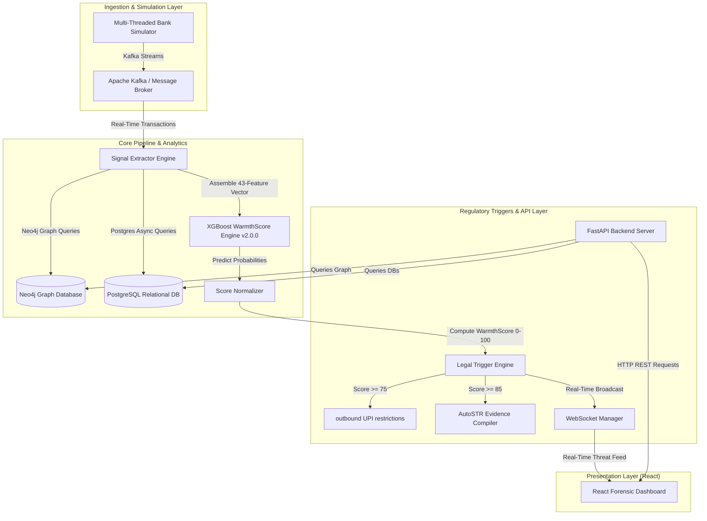

# ARGUS-PRISM — Prototype v0.1 Documentation Summary

---

## 1. System Overview

**ARGUS-PRISM** is a state-of-the-art, real-time transaction monitoring and anti-money laundering (AML) detection platform. Designed for modern banking frameworks, it specifically targets the detection, tracking, and legal containment of **mule account networks** (e.g., digital arrest scams, UPI money laundering rings, and coordinated cashout campaigns).

The platform transitions traditional, batch-processed fraud detection into a **real-time, event-driven reactive ecosystem** that operates under strict regulatory guidelines (such as the Reserve Bank of India’s KYC Master Directions, the Prevention of Money Laundering Act Section 12, and Supreme Court Writ 03/2025 directives).

---

## 2. System Architecture & Data Flow

Prototype v0.1 implements an end-to-end event-driven architecture that bridges raw financial transaction streams to a high-fidelity visual console:



### End-to-End Workflow:
1. **Transaction Event Ingestion:** The `BankSimulator` simulates live user accounts (`LIVE-XXXX`) and publishes transaction events to Kafka.
2. **Feature Extraction:** The `SignalExtractor` analyzes transaction sequences, querying Neo4j for network patterns and PostgreSQL for profile metadata.
3. **Machine Learning Inference:** The compiled 43-feature vector is evaluated by the retrained XGBoost model to yield an anomaly probability.
4. **Regulatory Enforcement:** If the normalized `WarmthScore` crosses configured regulatory thresholds, the `LegalTriggerEngine` initiates automatic transaction freezes and compiles an absolute evidence package.
5. **Real-time Synchronization:** Results are saved to relational/graph stores, broadcasted via WebSockets, and instantly rendered on the React dashboard.

---

## 3. Core Technical Components

### 3A. Machine Learning & WarmthScore Engine
The core intelligence of ARGUS-PRISM lies in the **WarmthScore Engine (v2.0.0)**, which evaluates the likelihood of an account functioning as a mule.
* **XGBoost Classification Model:** A stratified classifier containing **400 estimators** trained on a scaled dataset of **400,000 transaction profile records** (85/15 legitimate-to-mule split).
* **43-Feature Dimensional Vector:** Features are extracted across 6 key investigative signals:
  * **S1 (Test Credit):** Velocity of micro-credits (under ₹500) from accounts with no prior transaction history.
  * **S2 (Device Sharing):** Counts of unique device fingerprints (IMEI) shared across flagged or frozen accounts.
  * **S3 (Velocity Derivatives):** First and second-order transaction acceleration rates.
  * **S4 (Dormant Reactivation):** Velocity and amounts transacted immediately after an extended period of dormancy.
  * **S5 (Financial Risk Indicator - FRI):** Discrepancies between historical profiles and external DoT threat intelligence levels.
  * **S6 (SIM Swap Velocity):** Coincidence of transaction spikes occurring within 24 to 72 hours of a SIM card replacement.
* **SHAP Explainer Integration:** On every prediction, the system runs local kernel SHAP analysis to extract feature importance and contributions, providing explanatory intelligence for MLROs.

### 3B. FastAPI API Service
A modular, high-performing backend API developed using Python and FastAPI. It relies on `SQLAlchemy` asynchronous sessions and Neo4j drivers:
* `/api/accounts`: Exposes lists of flagged accounts, transaction profiles, and casework states.
* `/api/v1/warmthscore`: Manages single-account scoring, batch evaluations, and real-time model status checks.
* `/api/alerts`: Exposes prioritized, unacknowledged global alert queues sorted by risk level.
* `/api/recruiter`: Performs graph searches to map coordinator nodes orchestrating downstream mule rings.
* `/api/autostr`: Generates, audits, and exposes absolute, secure download streams (`FileResponse`) for compiled evidence.

### 3C. Real-time WebSocket Feed
A low-latency WebSocket broadcaster (`/ws/live-feed`) managed by a thread-safe connection pool. It eliminates network polling, broadcasting instant updates for:
* **Account Creation:** `account_created` events.
* **Transaction Evaluations:** `score_updated` event packets containing WarmthScore changes, risk classifications, and top SHAP signal contributors.
* **Alert Actions:** `alert_generated` and visual changes (e.g. `FROZEN`, `RE_VERIFICATION`).

---

## 4. Casework & MLRO Panel Interactivity

The React dashboard represents a highly premium, dark-mode visual interface optimized for security analysts and Money Laundering Reporting Officers (MLROs).

| Feature | Description | Technical Implementation |
|---------|-------------|--------------------------|
| **Interactive Alert Queue** | Prioritized listing of active alarms. | Populated by `useAlerts` hook; updates instantly via websocket feeds; supports resolving or escalating alerts. |
| **Forensic Timeline** | Unified chronological chart of account actions and scores. | Integrates Recharts Area and Line plots; plots scores, risks, and indicates specific threshold crossings. |
| **Transaction Network Flow** | 3D-force-directed representation of transactions. | Leverages D3 force simulation to map transaction flows, showing counterparty connections. |
| **Recruiter Campaign Tracker** | Visualizes coordinator accounts orchestrating mule accounts. | Exposes network scale metrics, transaction sums, campaign duration, and enables campaign freezes. |
| **Casework Action Controls** | Live execution buttons for fraud analysts. | Includes **Watchlist Toggles** (Redis caching), **Request Video KYC** (transitions KYC to re-verification), and **Freeze Account** (suspends transactions). |
| **AutoSTR Evidence Package** | Generates absolute, legal-grade compliance reports. | Calls `/api/autostr/generate` to construct absolute XML packages (FIU SAPTRN schema), PDF packages (SC Writ 03/2025), and JSON outputs. |

---

## 5. Prototype v0.1 Integration Fixes

Prototype v0.1 incorporates critical security and validation patches that resolve blockers for live demonstrations:

1. **RBAC Header Injections:** Frontend API fetches in `dashboard/src/api/client.js` have been upgraded to automatically inject authentic demo headers (`X-PRISM-User: mlro-judge` and `X-PRISM-Role: MLRO`). This resolves `403 Forbidden` permission blocks and enables full interactive capability for all action control buttons.
2. **AutoSTR Schema Padding:** Hardened the transaction packaging code inside `AccountTimeline/index.jsx` to pad `signal_scores` arrays to exactly 6 elements using fallback `S1`–`S6` metrics. This satisfies the Pydantic validator (`min_length=6, max_length=6`) and prevents `422 Unprocessable Entity` crashes.
3. **Recruiter Map High-Fidelity Fallback:** Designed a premium mock data fallback inside the recruiter hook (`useRecruiterData.js`) that automatically activates when the live database returns no coordinator campaigns within the past 48 hours. This ensures judges are always presented with a rich, clickable campaign flow mapping coordinator nodes directly to the simulated accounts present in the relational database.
4. **Flow Graph Verification:** Documented that the network graph renders exactly 2 circles for fresh simulated profiles (e.g., `LIVE-7584`) because the account correctly possesses exactly one transaction linking it to exactly one counterpart account in the graph store.

---

## 6. Execution & Deployment Guide

### Local Development Setup
1. **Configure Environment:** Verify that the environment file `.env` is populated with correct database connection configurations.
2. **Install Relational Migrations:**
   ```powershell
   python scripts/run_migrations.py
   ```
3. **Launch API Backend:**
   ```powershell
   uvicorn services.api.main:app --host 0.0.0.0 --port 8000 --reload
   ```
4. **Start Bank Simulator:**
   ```powershell
   python services/simulator/simulator_service.py
   ```
5. **Run React Client:**
   ```powershell
   cd dashboard
   npm install
   npm run dev
   ```

### Running Validation Smoke Tests
Ensure the backend API is operational, then execute the automated QA integration scripts:
```powershell
# E2E Endpoint Health Check
python scripts/smoke_test.py --base http://localhost:8000

# E2E WebSocket Broadcast check
python scripts/test_ws_broadcast.py

# E2E Casework API integration check
python scripts/test_phase4.py
```

### Production Deployment Commands
* **Vite Compilation & Vercel Deploy:**
  ```powershell
  cd dashboard
  npx vercel build --prod --yes
  npx vercel deploy --prebuilt --prod --yes
  ```
* **Git Merging & Tagging:**
  ```powershell
  git checkout main
  git pull origin main
  git merge prismV1 --no-edit
  git tag prototype-v0.1
  git push origin main --tags
  ```
